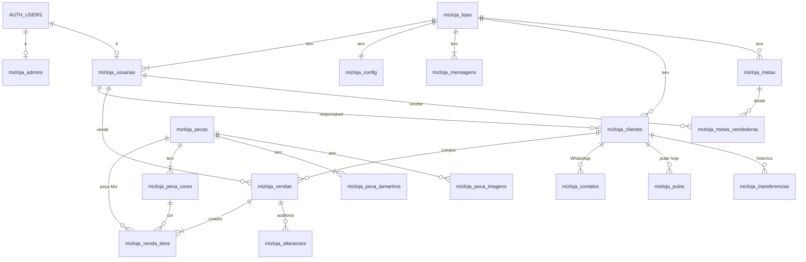

# MIZ Loja · Banco de dados

Projeto Supabase `usemizdigitalAPP` (`ldlwdxgjiohuvionihhv`, sa-east-1), compartilhado com o app MIZ. Tudo do MIZ Loja tem prefixo `mizloja_` e é **independente** das tabelas do app MIZ: nenhuma chave estrangeira, view ou função aponta para elas. Migrations em `supabase/migrations/`.

> Atualize este arquivo a cada mudança de banco.

## Independência

| Assunto | Como ficou |
| --- | --- |
| Lojas e usuárias | Tabelas próprias (`mizloja_lojas`, `mizloja_usuarias`). Não há ligação com `public.profiles`. |
| Admin Miz | Tabela própria `mizloja_admins` (não usa `profiles.role`). Carga inicial: conta `usemizdigital@gmail.com`. |
| Catálogo | Tabelas próprias (`mizloja_pecas`, `mizloja_peca_cores`, `mizloja_peca_tamanhos`, `mizloja_peca_imagens`), carregadas uma vez por cópia de `public.pecas` e afins. `origem_id` = id no app MIZ, só como referência. |
| Login | O Auth é único no projeto. O gatilho do app MIZ cria um profile para todo usuário novo; o gatilho `mizloja_auth_limpar_profile` (constraint trigger adiado, em `auth.users`) apaga esse profile no fim da mesma transação quando `raw_user_meta_data->>'app' = 'mizloja'`. Nada do app MIZ foi alterado. |
| Funções de apoio do RLS | Schema próprio `mizloja_interno`, fora da API REST. |

## Diagrama

## Tabelas

### mizloja_admins — Admin Miz
| Coluna | Tipo | Significado |
| --- | --- | --- |
| id | uuid PK → auth.users | Usuário do time Miz |
| nome | text | Nome |
| ativo | boolean | Desligar sem apagar |
| created_at | timestamptz | |

### mizloja_lojas
| Coluna | Tipo | Significado |
| --- | --- | --- |
| id | uuid PK | |
| nome, cidade | text | |
| cnpj | text único | 14 dígitos (gatilho limpa pontuação) |
| uf | char(2) | Maiúsculas |
| whatsapp | text | Só dígitos com 55 |
| situacao | ativa / inativa | Inativa bloqueia todas as usuárias da loja |
| criado_por | uuid → auth.users | |
| created_at, updated_at | timestamptz | |

Gatilhos: normaliza campos; ADM não muda `cnpj` nem `situacao`; ao criar, gera `mizloja_config` e as 2 mensagens padrão.

### mizloja_usuarias — ADM e vendedoras
| Coluna | Tipo | Significado |
| --- | --- | --- |
| id | uuid PK → auth.users | Mesma conta do Auth |
| loja_id | uuid → lojas | Uma loja por usuária |
| perfil | adm / vendedora | |
| nome | text | |
| whatsapp | text | `55` + DDD + número |
| usuario | text único | Login (= WhatsApp normalizado no cadastro) |
| email | text | Recuperação de senha da dona |
| precisa_trocar_senha | boolean | true até a 1ª troca |
| situacao | ativa / inativa | |
| ultimo_acesso_em | timestamptz | |
| criado_por, created_at, updated_at | | |

Gatilho: ninguém pela API muda `perfil`, `loja_id`, `usuario`, `precisa_trocar_senha`, `ultimo_acesso_em`; a ADM não desativa a si mesma.

### mizloja_config — prazos da loja (1 linha por loja)
`dias_pos_venda` 5 · `dias_pos_venda_limite` 10 · `dias_comprou` 15 · `dias_recompra` 30 · `dias_sumida` 60 · `dias_inativa` 90 · `dias_followup_conversa` 15 · `dias_followup_recontato` 30 · `visibilidade_vendedora` (proprias/todas) · `ranking_visivel` · `atualizado_por` · `updated_at`. Checks: `pos_venda ≤ limite`; `comprou ≤ recompra < sumida ≤ inativa`.

### mizloja_mensagens — textos de WhatsApp
PK (`loja_id`, `tipo` aniversario/pos_venda); `texto` até 300 caracteres, variáveis `[NOME]` e `[LOJA]`; `atualizado_por`, `updated_at`.

### Catálogo
| Tabela | Colunas |
| --- | --- |
| mizloja_pecas | id, nome, codigo_referencia (único), categoria, ativa, esgotado, origem_id, created_at, updated_at |
| mizloja_peca_cores | id, peca_id, nome (padronizado: "Off White", "Preto"), valor (hex `#rrggbb`), ordem, origem_id |
| mizloja_peca_tamanhos | id, peca_id, valor (PP, P, M, G, GG, PP/P, M/G, Unico), ordem; único (peca_id, valor) |
| mizloja_peca_imagens | id, peca_id, url, ordem |

Carga inicial: 18 peças, 70 cores, 50 tamanhos, 71 imagens. As URLs das imagens ainda apontam para o storage do app MIZ.

### mizloja_clientes
| Coluna | Significado |
| --- | --- |
| id, loja_id | |
| nome, nome_busca | nome_busca = minúsculas sem acento (gatilho) |
| whatsapp | 55 + DDD + número; único por loja |
| aniv_dia, aniv_mes, aniv_ano | Dia e mês juntos ou nenhum; ano opcional |
| observacoes | até 500 |
| origem | loja / lead_miz |
| vendedora_id | Responsável (→ usuárias) |
| cadastrada_por | Quem cadastrou |
| etapa_manual | novas / em_conversa / sem_interesse |
| recado_transferencia | Recado deixado ao transferir |
| ultimo_contato_em, ultimo_contato_por | Último toque no WhatsApp |
| num_compras, total_gasto, ticket_medio, primeira_compra_em, ultima_compra_em, intervalo_medio_dias, tamanho_preferido, cores_preferidas, pecas_miz_compradas | **Calculados** (ignoram vendas excluídas). Não podem ser alterados pela API |
| created_at, updated_at | |

Regras do gatilho: apara e normaliza; no cadastro pela tela, `cadastrada_por` = quem cadastrou e `vendedora_id` = ela mesma quando vazio (vendedora não cadastra para colega; ADM pode). Responsável só muda por `mizloja_transferir_cliente`, `mizloja_transferir_carteira` ou por venda.

### mizloja_vendas
| Coluna | Significado |
| --- | --- |
| id, loja_id (copiado da cliente) | |
| cliente_id | → clientes (não pode apagar cliente com venda) |
| vendedora_id | Quem vendeu |
| lancada_por | Quem lançou (auth.uid()) |
| data_venda | Até 7 dias atrás para vendedora; qualquer data passada para ADM; nunca futura |
| valor_total | > 0 |
| forma_pagamento | pix, cartao_credito, cartao_debito, dinheiro, crediario |
| tem_peca_miz | Mantido pelos itens |
| excluida, excluida_em, excluida_por, motivo_exclusao | Exclusão lógica; motivo obrigatório; só ADM restaura |
| created_at, updated_at | |

### mizloja_venda_itens
`id`, `venda_id`, `loja_id` (copiado), `tipo` (miz/outra), `peca_id`, `peca_cor_id`, `peca_nome`, `peca_codigo`, `cor`, `cor_hex`, `tamanho`, `quantidade`, `created_at`.
Peça Miz: exige peça e cor da própria peça, tamanho dentro da grade; copia nome, código, cor e hex. Outra marca: cor digitada, sem peça. Tamanho aceita "unico/Único/U" → `Unico`.

### mizloja_metas e mizloja_metas_vendedoras
Metas: `loja_id`, `mes` (dia 1; único por loja), `valor_loja`, `status` rascunho/publicada, `publicada_em` (gatilho), `premio_descricao`, `premio_condicao_pct` (100), `premio_extra_descricao`, `premio_extra_pct`, `criado_por`.
Por vendedora: `meta_id`, `loja_id` (copiado), `usuaria_id`, `valor` (nulo = sem meta individual), `premio_elegivel`; único (meta, usuária).

### mizloja_contatos, mizloja_pulos, mizloja_transferencias, mizloja_alteracoes
- **contatos:** cada toque no WhatsApp (`cliente_id`, `usuaria_id`, `pasta` ou nulo, `created_at`). Atualiza o último contato da cliente e, se ela não comprou e está em novas/sem etapa, passa para `em_conversa`.
- **pulos:** "Pular hoje" (`cliente_id`, `usuaria_id`, `data`); único por cliente/usuária/dia; a usuária pode desfazer.
- **transferencias:** `de_usuaria_id`, `para_usuaria_id`, `motivo` (venda, manual, desativacao, adm), `recado`, `criado_por`. Escrita só por funções/gatilhos.
- **alteracoes:** `venda_id`, `usuaria_id`, `acao` (edicao/exclusao), `antes`, `depois` (jsonb; para itens vem `{"item": {...}}`), `motivo`. Escrita só por gatilho.

## Funções

| Função | Parâmetros | Retorno | Observações |
| --- | --- | --- | --- |
| `mizloja_normalizar_whatsapp` | texto | text | Só dígitos; 10–11 dígitos → prefixa 55 |
| `mizloja_hoje` | — | date | Hoje em São Paulo |
| `mizloja_data_local` | timestamptz | date | Data em São Paulo |
| `mizloja_sem_acento` | texto | text | minúsculo, sem acento |
| `mizloja_proximo_aniversario` | dia, mes, ref | date | 29/02 → 28/02 em ano não bissexto |
| `mizloja_eh_interno` | — | boolean | Comando vindo de função interna/service role |
| `mizloja_interno.mizloja_eh_admin_miz` | — | boolean | |
| `mizloja_interno.mizloja_minha_loja` | — | uuid | Nulo se usuária ou loja inativa |
| `mizloja_interno.mizloja_meu_perfil` | — | text | adm / vendedora |
| `mizloja_interno.mizloja_eh_adm` | loja uuid | boolean | |
| `mizloja_recalcular_cliente` | cliente uuid | void | Interna. Tamanho = maior quantidade (empate: mais recente); cores = 3 maiores; intervalo = (última − primeira) ÷ (n − 1) |
| `mizloja_lancar_venda` | p_cliente_id, p_valor_total, p_forma_pagamento, p_itens jsonb, p_data_venda = now(), p_vendedora_id = auth.uid() | uuid da venda | Invoker (respeita RLS). Itens: `[{tipo, peca_id, peca_cor_id, cor, cor_hex, tamanho, quantidade}]` |
| `mizloja_buscar_clientes` | p_termo, p_limite = 20 (máx. 50) | id, nome, whatsapp_final (4 últimos), ultima_compra_em, num_compras, vendedora_id, vendedora_nome | Base inteira da loja. A partir de 2 caracteres. Só números → busca no WhatsApp; texto → nome sem acento (contém ou semelhança ≥ 0,5) |
| `mizloja_transferir_cliente` | p_cliente_id, p_para_usuaria_id, p_recado = null | void | Vendedora só transfere clientes dela (ou sem responsável); motivo manual/adm |
| `mizloja_transferir_carteira` | p_de, p_para | integer (qtd) | Só ADM; motivo desativacao |
| `mizloja_registrar_acesso` | — | void | |
| `mizloja_senha_trocada` | — | void | |
| `mizloja_tarefas_hoje` | — | cliente_id, nome, whatsapp, pasta, motivo, ultima_compra_em, total_gasto, vendedora_id | Ver regras abaixo |

### Regras de `mizloja_tarefas_hoje`
Uma pasta por cliente, prioridade **aniversario > pos_venda > follow_up**. Fora: `sem_interesse` e puladas hoje pela usuária. Vendedora vê as próprias (ou todas, se `visibilidade_vendedora = todas`); ADM vê as próprias.
- **Aniversário:** hoje até +2 dias, sem contato na pasta aniversário nos últimos 7 dias. "Aniversário hoje" / "Aniversário amanhã" / "Aniversário em 2 dias".
- **Pós-venda:** última compra entre `dias_pos_venda` e `dias_pos_venda_limite` dias, sem contato depois dela. "Comprou há 6 dias".
- **Follow-up** (nesta ordem): transferida (não por venda) sem contato depois → "Transferida pela Júlia"; sem compra e nunca contatada → "Nova, ainda sem conversa"; sem compra e último contato há `dias_followup_conversa`+ → "Sem resposta há 20 dias"; com compra há `dias_sumida`+ e sem contato há `dias_followup_recontato` → "Sumida há 75 dias"; com compra há `dias_recompra`+ → "40 dias sem comprar".

### View `mizloja_v_clientes` (security_invoker)
Todas as colunas de clientes + `vendedora_nome`, `dias_sem_comprar`, `proximo_aniversario`, `dias_para_aniversario`, e:
- **status:** nova (0 compras) · vip (3+ compras e < dias_sumida) · ativa (< dias_recompra) · esfriando (< dias_sumida) · sumida (≤ dias_inativa) · inativa.
- **etapa_kanban:** sem_interesse · sem compra: em_conversa (manual ou já contatada) ou novas · com compra: comprou (≤ dias_comprou), ativa (< dias_recompra), recompra (< dias_sumida), sumidas.

A view mostra a base inteira da loja; o filtro "só minhas" da vendedora é feito na tela.

## Regras de acesso (RLS) em linguagem simples
- **anon** não acessa nada do MIZ Loja.
- **Admin Miz:** vê e gerencia lojas, usuárias e catálogo. Não lê clientes, vendas, metas nem contatos.
- **Usuária inativa ou de loja inativa:** só consegue ler a própria linha em `mizloja_usuarias` (para a tela de login saber o motivo).
- **Lojas:** cada usuária vê só a própria; ADM edita dados da loja, exceto CNPJ e situação.
- **Usuárias:** vê as colegas da mesma loja; ADM edita nome, WhatsApp, e-mail e situação; criar e apagar só Admin Miz ou service role.
- **Catálogo:** qualquer usuária ativa lê; só Admin Miz escreve.
- **Clientes:** qualquer usuária ativa da loja lê, cadastra e edita (busca na base inteira); só ADM apaga.
- **Vendas e itens:** a loja toda lê (histórico completo na ficha); qualquer usuária lança; edita a ADM sempre e a vendedora só as próprias até 24 h após o lançamento; não existe DELETE de venda (exclusão lógica).
- **Metas:** ADM vê e escreve tudo; vendedora vê só metas publicadas e só a própria meta individual.
- **Contatos e pulos:** a loja lê; cada usuária grava só em nome próprio; pulo pode ser desfeito pela própria usuária.
- **Transferências:** a loja lê; escrita só pelas funções.
- **Mensagens e config:** a loja lê; só ADM altera.
- **Alterações:** só ADM lê; escrita só por gatilho.

## Migrations aplicadas
| Versão | Nome |
| --- | --- |
| 20261003210648 | mizloja_extensoes |
| 20261003210701 | mizloja_funcoes_base |
| 20261003210726 | mizloja_admins_lojas_usuarias |
| 20261003210754 | mizloja_config_mensagens |
| 20261003210810 | mizloja_catalogo |
| 20261003210832 | mizloja_clientes |
| 20261003210904 | mizloja_vendas |
| 20261003210925 | mizloja_contatos_pulos_transferencias_alteracoes |
| 20261003210940 | mizloja_metas |
| 20261003211002 | mizloja_recalculo_e_gatilhos_vendas |
| 20261003211040 | mizloja_rls |
| 20261003211118 | mizloja_funcoes_app |
| 20261003211242 | mizloja_tarefas_hoje |
| 20261003211358 | mizloja_v_clientes |
| 20261003211402 | mizloja_auth_independente |
| 20261003211437 | mizloja_permissoes_funcoes |
| 20261003211600 | mizloja_admin_inicial |
| 20261003212008 | mizloja_schema_interno |
