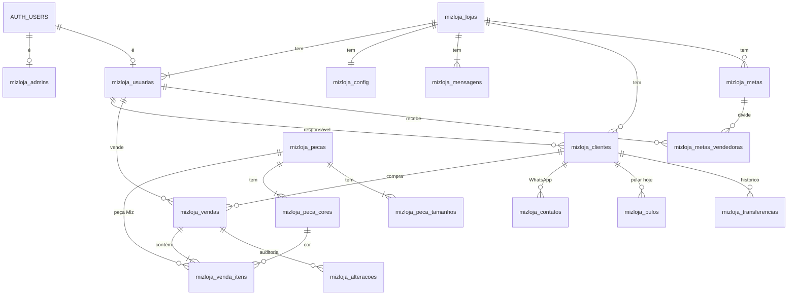

# MIZ Loja · Banco de dados

Projeto Supabase `usemizdigitalAPP` (`ldlwdxgjiohuvionihhv`, sa-east-1), compartilhado com o app MIZ. Tudo do MIZ Loja tem prefixo `mizloja_` e é **independente** das tabelas do app MIZ: nenhuma chave estrangeira, view ou função aponta para elas. Migrations em `supabase/migrations/`.

> Atualize este arquivo a cada mudança de banco.

## Independência

| Assunto | Como ficou |
| --- | --- |
| Lojas e usuárias | Tabelas próprias (`mizloja_lojas`, `mizloja_usuarias`). Não há ligação com `public.profiles`. |
| Admin Miz | Tabela própria `mizloja_admins` (não usa `profiles.role`). Carga inicial: conta `usemizdigital@gmail.com`. |
| Catálogo | Tabelas próprias (`mizloja_pecas`, `mizloja_peca_cores`, `mizloja_peca_tamanhos`), carregadas uma vez por cópia de `public.pecas` e afins. `origem_id` = id no app MIZ, só como referência. **Sem fotos** (decisão da etapa 2): `mizloja_peca_imagens` sai pela migration pendente `supabase/migrations-pendentes/mizloja_sem_imagens.sql`. |
| Login | O Auth é único no projeto. O gatilho do app MIZ cria um profile para todo usuário novo; o gatilho `mizloja_auth_limpar_profile` (constraint trigger adiado, em `auth.users`) apaga esse profile no fim da mesma transação quando `raw_user_meta_data->>'app' = 'mizloja'`. Nada do app MIZ foi alterado. |
| Funções de apoio do RLS | Schema próprio `mizloja_interno`, fora da API REST. |

## Diagrama

## Tabelas

### mizloja_admins — Admin Miz
| Coluna | Tipo | Significado |
| --- | --- | --- |
| id | uuid PK → auth.users | Usuário do time Miz |
| nome | text | Nome (único campo editável pela API) |
| whatsapp | text | 55 + DDD + número |
| usuario | text único | Login (= WhatsApp no cadastro). Trocar de número = criar conta nova |
| precisa_trocar_senha | boolean | true ao criar e ao gerar nova senha |
| ultimo_acesso_em | timestamptz | |
| ativo | boolean | Desligar sem apagar (só pela Edge Function) |
| criado_por | uuid → auth.users | |
| created_at, updated_at | timestamptz | |

Permissão: `authenticated` só lê (RLS: a própria linha ou Admin Miz) e só atualiza a coluna `nome` (grant de coluna + política `mizloja_admins_update`, só Admin Miz). Gatilho `mizloja_admins_antes` normaliza o WhatsApp e impede, fora de funções internas, mudar usuário, senha, situação e autoria.

### mizloja_lojas
| Coluna | Tipo | Significado |
| --- | --- | --- |
| id | uuid PK | |
| nome, cidade | text | |
| cnpj | text único | 14 dígitos (gatilho limpa pontuação) |
| uf | char(2) | Maiúsculas |
| whatsapp | text | Só dígitos com 55 |
| situacao | ativa / inativa | Inativa bloqueia todas as usuárias da loja |
| criado_por | uuid → auth.users | |
| created_at, updated_at | timestamptz | |

Gatilhos: normaliza campos; ADM não muda `cnpj` nem `situacao`; ao criar, gera `mizloja_config` e as 2 mensagens padrão.

### mizloja_usuarias — ADM e vendedoras
| Coluna | Tipo | Significado |
| --- | --- | --- |
| id | uuid PK → auth.users | Mesma conta do Auth |
| loja_id | uuid → lojas | Uma loja por usuária |
| perfil | adm / vendedora | |
| nome | text | |
| whatsapp | text | `55` + DDD + número |
| usuario | text único | Login (= WhatsApp normalizado no cadastro) |
| email | text | Recuperação de senha da dona |
| precisa_trocar_senha | boolean | true até a 1ª troca |
| situacao | ativa / inativa | |
| ultimo_acesso_em | timestamptz | |
| criado_por, created_at, updated_at | | |

Gatilho: ninguém pela API muda `perfil`, `loja_id`, `usuario`, `precisa_trocar_senha`, `ultimo_acesso_em`; a ADM não desativa a si mesma.

### mizloja_config — prazos da loja (1 linha por loja)
`dias_pos_venda` 5 · `dias_pos_venda_limite` 10 · `dias_comprou` 15 · `dias_recompra` 30 · `dias_sumida` 60 · `dias_inativa` 90 · `dias_followup_conversa` 15 · `dias_followup_recontato` 30 · `visibilidade_vendedora` (proprias/todas) · `ranking_visivel` · `atualizado_por` · `updated_at`. Checks: `pos_venda ≤ limite`; `comprou ≤ recompra < sumida ≤ inativa`.

### mizloja_mensagens — textos de WhatsApp
PK (`loja_id`, `tipo` aniversario/pos_venda); `texto` até 300 caracteres, variáveis `[NOME]` e `[LOJA]`; `atualizado_por`, `updated_at`.

### Catálogo (sem fotos)
| Tabela | Colunas |
| --- | --- |
| mizloja_pecas | id, nome, codigo_referencia (único, maiúsculas), categoria, composicao ("base/composição"), ativa, esgotado, origem_id, created_at, updated_at |
| mizloja_peca_cores | id, peca_id, nome (padronizado: "Off White", "Preto"; único por peça, sem diferenciar maiúscula), valor (hex `#rrggbb` minúsculo), ordem, **ativa**, origem_id |
| mizloja_peca_tamanhos | id, peca_id, valor (PP, P, M, G, GG, PP/P, M/G, Unico), ordem; único (peca_id, valor) |

Carga inicial: 18 peças, 70 cores, 50 tamanhos. Gatilho `mizloja_tg_catalogo_padronizar` mantém o padrão nas próximas gravações (apara nomes, código em maiúsculas, hex minúsculo, "único/U" → `Unico`).
Peça ou cor **já usada em venda não se apaga** (chave estrangeira com `on delete restrict`): só se desativa. Peça ou cor desativada não entra em item novo, mas continua no histórico. A tabela `mizloja_peca_imagens` (cópia das fotos) ainda existe até a migration pendente ser aplicada; o site não a usa.

### mizloja_clientes
| Coluna | Significado |
| --- | --- |
| id, loja_id | |
| nome, nome_busca | nome_busca = minúsculas sem acento (gatilho) |
| whatsapp | 55 + DDD + número; único por loja |
| aniv_dia, aniv_mes, aniv_ano | Dia e mês juntos ou nenhum; ano opcional |
| observacoes | até 500 |
| origem | loja / lead_miz |
| vendedora_id | Responsável (→ usuárias) |
| cadastrada_por | Quem cadastrou |
| etapa_manual | novas / em_conversa / sem_interesse |
| recado_transferencia | Recado deixado ao transferir |
| ultimo_contato_em, ultimo_contato_por | Último toque no WhatsApp |
| num_compras, total_gasto, ticket_medio, primeira_compra_em, ultima_compra_em, intervalo_medio_dias, tamanho_preferido, cores_preferidas, pecas_miz_compradas | **Calculados** (ignoram vendas excluídas). Não podem ser alterados pela API |
| created_at, updated_at | |

Regras do gatilho: apara e normaliza; no cadastro pela tela, `cadastrada_por` = quem cadastrou e `vendedora_id` = ela mesma quando vazio (vendedora não cadastra para colega; ADM pode). Responsável só muda por `mizloja_transferir_cliente`, `mizloja_transferir_carteira` ou por venda.

### mizloja_vendas
| Coluna | Significado |
| --- | --- |
| id, loja_id (copiado da cliente) | |
| cliente_id | → clientes (não pode apagar cliente com venda) |
| vendedora_id | Quem vendeu |
| lancada_por | Quem lançou (auth.uid()) |
| data_venda | Até 7 dias atrás para vendedora; qualquer data passada para ADM; nunca futura |
| valor_total | > 0 |
| forma_pagamento | pix, cartao_credito, cartao_debito, dinheiro, crediario |
| tem_peca_miz | Mantido pelos itens |
| excluida, excluida_em, excluida_por, motivo_exclusao | Exclusão lógica; motivo obrigatório; só ADM restaura |
| created_at, updated_at | |

### mizloja_venda_itens
`id`, `venda_id`, `loja_id` (copiado), `tipo` (miz/outra), `peca_id`, `peca_cor_id`, `peca_nome`, `peca_codigo`, `cor`, `cor_hex`, `tamanho`, `quantidade`, `created_at`.
Peça Miz: exige peça e cor (ativas) da própria peça e o tamanho da **grade cadastrada da peça** (ex.: PP/P, M/G); copia nome, código, cor e hex. Outra marca: cor digitada, sem peça, tamanho só PP, P, M, G, GG ou Unico. Tamanho aceita "unico/Único/U" → `Unico`.

### mizloja_metas e mizloja_metas_vendedoras
Metas: `loja_id`, `mes` (dia 1; único por loja), `valor_loja`, `status` rascunho/publicada, `publicada_em` (gatilho), `premio_descricao`, `premio_condicao_pct` (100), `premio_extra_descricao`, `premio_extra_pct`, `criado_por`.
Por vendedora: `meta_id`, `loja_id` (copiado), `usuaria_id`, `valor` (nulo = sem meta individual), `premio_elegivel`; único (meta, usuária).

### mizloja_contatos, mizloja_pulos, mizloja_transferencias, mizloja_alteracoes
- **contatos:** cada toque no WhatsApp (`cliente_id`, `usuaria_id`, `pasta` ou nulo, `created_at`). Atualiza o último contato da cliente e, se ela não comprou e está em novas/sem etapa, passa para `em_conversa`.
- **pulos:** "Pular hoje" (`cliente_id`, `usuaria_id`, `data`); único por cliente/usuária/dia; a usuária pode desfazer.
- **transferencias:** `de_usuaria_id`, `para_usuaria_id`, `motivo` (venda, manual, desativacao, adm), `recado`, `criado_por`. Escrita só por funções/gatilhos.
- **alteracoes:** `venda_id`, `usuaria_id`, `acao` (edicao/exclusao), `antes`, `depois` (jsonb; para itens vem `{"item": {...}}`), `motivo`. Escrita só por gatilho.

## Funções

| Função | Parâmetros | Retorno | Observações |
| --- | --- | --- | --- |
| `mizloja_normalizar_whatsapp` | texto | text | Só dígitos; 10–11 dígitos → prefixa 55 |
| `mizloja_hoje` | — | date | Hoje em São Paulo |
| `mizloja_data_local` | timestamptz | date | Data em São Paulo |
| `mizloja_sem_acento` | texto | text | minúsculo, sem acento |
| `mizloja_proximo_aniversario` | dia, mes, ref | date | 29/02 → 28/02 em ano não bissexto |
| `mizloja_eh_interno` | — | boolean | Comando vindo de função interna/service role |
| `mizloja_interno.mizloja_eh_admin_miz` | — | boolean | |
| `mizloja_interno.mizloja_minha_loja` | — | uuid | Nulo se usuária ou loja inativa |
| `mizloja_interno.mizloja_meu_perfil` | — | text | adm / vendedora |
| `mizloja_interno.mizloja_eh_adm` | loja uuid | boolean | |
| `mizloja_recalcular_cliente` | cliente uuid | void | Interna. Tamanho = maior quantidade (empate: mais recente); cores = 3 maiores; intervalo = (última − primeira) ÷ (n − 1) |
| `mizloja_lancar_venda` | p_cliente_id, p_valor_total, p_forma_pagamento, p_itens jsonb, p_data_venda = now(), p_vendedora_id = auth.uid() | uuid da venda | Invoker (respeita RLS). **Mínimo 1 item.** Itens: `[{tipo, peca_id, peca_cor_id, cor, cor_hex, tamanho, quantidade}]` |
| `mizloja_buscar_clientes` | p_termo, p_limite = 20 (máx. 50) | id, nome, whatsapp_final (4 últimos), ultima_compra_em, num_compras, vendedora_id, vendedora_nome | Base inteira da loja. A partir de 2 caracteres. Só números → busca no WhatsApp; texto → nome sem acento (contém ou semelhança ≥ 0,5) |
| `mizloja_transferir_cliente` | p_cliente_id, p_para_usuaria_id, p_recado = null | void | Vendedora só transfere clientes dela (ou sem responsável); motivo manual/adm |
| `mizloja_transferir_carteira` | p_de, p_para | integer (qtd) | Só ADM; motivo desativacao |
| `mizloja_registrar_acesso` | — | void | Usuária e Admin Miz |
| `mizloja_senha_trocada` | — | void | Usuária e Admin Miz |
| `mizloja_tarefas_hoje` | — | cliente_id, nome, whatsapp, pasta, motivo, ultima_compra_em, total_gasto, vendedora_id | Ver regras abaixo |
| `mizloja_salvar_venda` | p_venda_id, p_cliente_id, p_valor_total, p_forma_pagamento, p_itens jsonb, p_data_venda = now(), p_cliente_nova jsonb = null | jsonb `{venda_id, cliente_id, ja_existia}` | Invoker. **Usada pela tela Lançar venda.** O id da venda (e da cliente nova) vem do navegador: reenviar a mesma venda (fila sem conexão) devolve a que já existe, sem duplicar. Cliente nova `{nome, whatsapp, aniv_dia, aniv_mes, aniv_ano}` é criada na mesma transação; se o WhatsApp já existe na loja, usa a cliente existente. Mínimo 1 item; vendedora = usuária logada |
| `mizloja_meu_resumo_mes` | p_mes = mês atual | mes, meta_individual, meta_loja (só sem individual), vendido_loja, vendido, num_vendas, ticket_medio, clientes_novas, dias_restantes, valor_por_dia, premio_descricao, premio_condicao_pct, premio_extra_descricao, premio_extra_pct, premio_conquistado, premio_extra_conquistado | Invoker. Só metas publicadas. Prêmio só com meta individual e `premio_elegivel`. Clientes novas = 1ª compra (não excluída) no mês, feita por ela. Dias restantes contam hoje |
| `mizloja_meu_historico_metas` | p_meses = 6 (máx. 24) | mes, vendido, meta, percentual, premio_ganho (nulo = mês sem prêmio) | Invoker. Meses anteriores ao atual |
| `mizloja_minhas_vendas_hoje` | — | total_dia, num_vendas, ultimas jsonb (3 últimas: id, cliente, valor, data, pagamento, itens) | Invoker. Hoje em São Paulo, vendas da usuária logada |
| `mizloja_cores_usadas` | p_limite = 40 | cor, usos | Invoker. Cores de outra marca já usadas na loja (agrupadas sem acento), para sugerir ao digitar |
| `mizloja_ranking_mes` | p_mes = mês atual | posicao, nome, sou_eu | Invoker. **Sem valores.** Vazio se `ranking_visivel` = false. Vendedoras ativas (e a ADM, se for ela) |
| `mizloja_alterar_meu_nome` | p_nome | text | Definer. Perfil: a usuária logada troca só o próprio nome (2 a 80 letras) |

### Regras de `mizloja_tarefas_hoje`
Uma pasta por cliente, prioridade **aniversario > pos_venda > follow_up**. Fora: `sem_interesse` e puladas hoje pela usuária. Vendedora vê as próprias (ou todas, se `visibilidade_vendedora = todas`); ADM vê as próprias.
- **Aniversário:** hoje até +2 dias, sem contato na pasta aniversário nos últimos 7 dias. "Aniversário hoje" / "Aniversário amanhã" / "Aniversário em 2 dias".
- **Pós-venda:** última compra entre `dias_pos_venda` e `dias_pos_venda_limite` dias, sem contato depois dela. "Comprou há 6 dias".
- **Follow-up** (nesta ordem): transferida (não por venda) sem contato depois → "Transferida pela Júlia"; sem compra e nunca contatada → "Nova, ainda sem conversa"; sem compra e último contato há `dias_followup_conversa`+ → "Sem resposta há 20 dias"; com compra há `dias_sumida`+ e sem contato há `dias_followup_recontato` → "Sumida há 75 dias"; com compra há `dias_recompra`+ → "40 dias sem comprar".

### View `mizloja_v_clientes` (security_invoker)
Todas as colunas de clientes + `vendedora_nome`, `dias_sem_comprar`, `proximo_aniversario`, `dias_para_aniversario`, e:
- **status:** nova (0 compras) · vip (3+ compras e < dias_sumida) · ativa (< dias_recompra) · esfriando (< dias_sumida) · sumida (≤ dias_inativa) · inativa.
- **etapa_kanban:** sem_interesse · sem compra: a etapa manual (novas ou em_conversa) quando existe; senão em_conversa se já contatada, ou novas · com compra: comprou (≤ dias_comprou), ativa (< dias_recompra), recompra (< dias_sumida), sumidas.
- **ultima_compra_valor:** valor da última venda não excluída (cartão do kanban).

A view mostra a base inteira da loja; o filtro "só minhas" da vendedora é feito na tela.

## Regras de acesso (RLS) em linguagem simples
- **anon** não acessa nada do MIZ Loja.
- **Admin Miz:** vê e gerencia lojas, usuárias e catálogo. Não lê clientes, vendas, metas nem contatos.
- **Usuária inativa ou de loja inativa:** só consegue ler a própria linha em `mizloja_usuarias` (para a tela de login saber o motivo).
- **Lojas:** cada usuária vê só a própria; ADM edita dados da loja, exceto CNPJ e situação.
- **Usuárias:** vê as colegas da mesma loja; ADM edita nome, WhatsApp, e-mail e situação; criar e apagar só Admin Miz ou service role.
- **Catálogo:** qualquer usuária ativa lê; só Admin Miz escreve.
- **Clientes:** qualquer usuária ativa da loja lê, cadastra e edita (busca na base inteira); só ADM apaga.
- **Vendas e itens:** a loja toda lê (histórico completo na ficha); qualquer usuária lança; edita a ADM sempre e a vendedora só as próprias até 24 h após o lançamento; não existe DELETE de venda (exclusão lógica).
- **Metas:** ADM vê e escreve tudo; vendedora vê só metas publicadas e só a própria meta individual.
- **Contatos e pulos:** a loja lê; cada usuária grava só em nome próprio; pulo pode ser desfeito pela própria usuária.
- **Transferências:** a loja lê; escrita só pelas funções.
- **Mensagens e config:** a loja lê; só ADM altera.
- **Alterações:** só ADM lê; escrita só por gatilho.

## Permissões de escrita por coluna
O RLS decide **quais linhas**; os grants decidem **quais colunas** a usuária logada (`authenticated`) pode gravar. Nenhuma tabela permite editar `id`, autoria, datas ou campos calculados pela API; isso só acontece por gatilhos, funções internas e Edge Functions (service role).

| Tabela | INSERT | UPDATE | DELETE |
| --- | --- | --- | --- |
| mizloja_admins | — (Edge Function) | nome | — |
| mizloja_lojas | — (Edge Function) | nome, cidade, uf, whatsapp | — |
| mizloja_usuarias | — (Edge Function) | nome, whatsapp, email | — |
| mizloja_pecas | nome, codigo_referencia, categoria, composicao, ativa, esgotado | os mesmos | sim (bloqueado se já vendida) |
| mizloja_peca_cores | peca_id, nome, valor, ordem, ativa | nome, valor, ordem, ativa | sim (bloqueado se já vendida) |
| mizloja_peca_tamanhos | peca_id, valor, ordem | ordem | sim |
| mizloja_clientes | id, loja_id, nome, whatsapp, aniv_dia/mes/ano, observacoes, origem, vendedora_id, etapa_manual | nome, whatsapp, aniv_dia/mes/ano, observacoes, origem, etapa_manual, recado_transferencia | sim (só ADM, pelo RLS) |
| mizloja_vendas | id, cliente_id, vendedora_id, data_venda, valor_total, forma_pagamento | os mesmos + excluida, motivo_exclusao | — (exclusão lógica) |
| mizloja_venda_itens | venda_id, tipo, peca_id, peca_cor_id, cor, cor_hex, tamanho, quantidade | os mesmos, menos venda_id | sim |
| mizloja_metas | loja_id, mes, valor_loja, status, premio_* | mes, valor_loja, status, premio_* | sim |
| mizloja_metas_vendedoras | meta_id, usuaria_id, valor, premio_elegivel | valor, premio_elegivel | sim |
| mizloja_contatos | cliente_id, pasta | — | — |
| mizloja_pulos | cliente_id | — | sim |
| mizloja_mensagens | — | texto | — |
| mizloja_config | — | dias_*, visibilidade_vendedora, ranking_visivel | — |
| mizloja_transferencias, mizloja_alteracoes | — | — | — |

`id` em clientes e vendas: o navegador escolhe o id (uuid) da venda e da cliente nova, para a fila sem conexão reenviar sem duplicar (migration `mizloja_painel_vendedora`).

## Migrations aplicadas
| Versão | Nome |
| --- | --- |
| 20261003210648 | mizloja_extensoes |
| 20261003210701 | mizloja_funcoes_base |
| 20261003210726 | mizloja_admins_lojas_usuarias |
| 20261003210754 | mizloja_config_mensagens |
| 20261003210810 | mizloja_catalogo |
| 20261003210832 | mizloja_clientes |
| 20261003210904 | mizloja_vendas |
| 20261003210925 | mizloja_contatos_pulos_transferencias_alteracoes |
| 20261003210940 | mizloja_metas |
| 20261003211002 | mizloja_recalculo_e_gatilhos_vendas |
| 20261003211040 | mizloja_rls |
| 20261003211118 | mizloja_funcoes_app |
| 20261003211242 | mizloja_tarefas_hoje |
| 20261003211358 | mizloja_v_clientes |
| 20261003211402 | mizloja_auth_independente |
| 20261003211437 | mizloja_permissoes_funcoes |
| 20261003211600 | mizloja_admin_inicial |
| 20261003212008 | mizloja_schema_interno |
| 20261003225159 | mizloja_admins_acesso |
| 20261003231852 | mizloja_catalogo_campos |
| 20261003232108 | mizloja_venda_minimo_um_item |
| 20261003232159 | mizloja_permissoes_colunas |
| 20261004001947 | mizloja_painel_vendedora |
| 20261004003321 | mizloja_kanban_etapa_manual |
| 20261004003421 | mizloja_v_clientes_valor_ultima_compra |
| 20261004004124 | mizloja_alterar_meu_nome |
| pendente | mizloja_sem_imagens (`supabase/migrations-pendentes/`) |

## Edge Functions (escrita com service role)

Criar conta no Auth, gerar senha, bloquear login e criar loja + dona acontecem só nas Edge Functions de `supabase/functions` (lista, quem chama e corpo das chamadas no `CLAUDE.md`, seção "Edge Functions"). Elas gravam nas colunas que a tabela acima marca como "Edge Function". Funções temporárias: `mizloja-primeiro-admin` (uso único, versão desligada no repositório) e `mizloja-seed-demo` (Loja Demonstração, `docs/DEMO.md`).

Pendente: a migration `mizloja_sem_imagens` (apaga `mizloja_peca_imagens`) está em `supabase/migrations-pendentes/` e ainda não foi aplicada (`docs/TESTES-PENDENTES.md`, item 0). Até lá a tabela continua no banco, sem uso pelo site.
